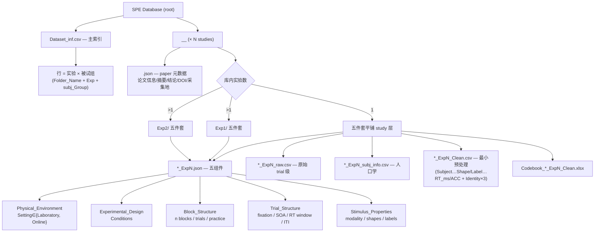

# Manu_v16_Methods.md 与库内实况一致性审计报告

> 审计日期：2026-09-02　|　性质：**只读审计**（§4 #7/#8 已于 2026-09-02 用户指示下修复，见行内标注）　|　依据：`3_Reports/Manu_v16_Methods.md`（32 行方法节）vs 全库实况
> 核验手段：全库脚本扫描（47 curated 文件夹 / 131 JSON / 86 Clean〔审计时点〕）+ 现有两级校验器基线。脚本存于临时目录，未入库。
> 相关规则出处：`.opencode/skills/spe-database-curation/SKILL.md`、`AGENTS.md`、`PROJ_STATE.md`（2026-09-02 精简版）。
> **2026-09-02 修复后快照**：Clean 84 文件（Liang 三分片合并为 1）、Codebook 84、JSON 131（47 paper 级 + 84 exp）；两级校验 EXIT=0（clean 0 ERROR / 27 WARN）。

---

## 1. 审计范围与基线

| 校验器 | 基线结果 | 与 PROJ_STATE §5 一致性 |
|---|---|---|
| `validate_json_metadata.R` | EXIT=0；131 JSON / 48 文件夹交叉一致；known_pending=Hu_YQ_2026_ChinaSciData | ✅ |
| `validate_clean_csv.R` | EXIT=0；86 文件 0 ERROR / 29 WARN | ✅（29 WARN 均为已知类：ACC=NA 16、nSubj 口径 28 行、缺标准列 Shape/Label 29 行、E2/E3 KNOWN 6 行） |

磁盘实况快照（实测）：**48 研究文件夹（47 curated + Scheller 输入区保留）；Dataset_inf.csv 102 行 / 48 unique Folder_Name；JSON 131（46 平铺 paper + 1 Kirk 嵌套 paper + 84 exp）；Codebook 86；Clean 86**。
PROJ_STATE §5 记账差异 1 项：记「46 paper + 85 exp = 131」，实测按内容键分类为「46 paper（含 Kirk 嵌套计为 paper？实为 46 Paper_name 平铺 + 1 Kirk Paper_ID 嵌套）+ 84 exp + 1 文件名含 `_Exp` 的 paper JSON（Orellana-2020，期刊名 `ExpPsych` 含子串）」。总数一致，拆分口径相差 1，归因于 Kirk 嵌套 schema 例外与文件名子串误捕，非库内错误。

---

## 2. 方法文 Claims 逐条判定矩阵

### A. 文件夹组织类

| Claim | 方法文原文要点 | 实况证据 | 判定 |
|---|---|---|---|
| **A1** 三层结构 root→study→experiment | "three-level folder structure… experiment folder (if there are multiple experiments)" | 23 个多实验研究全部用 ExpN 子文件夹（内部五件套齐全）；24 个单实验平铺在 study 层 | ✅ **一致**（例外见下） |
| **A1-例外** 多实验→子文件夹的普适性 | "each experiment has its own subfolders (e.g., Exp1, Exp2)" | 例外：`Martinez-Perez_2024_ConsciousCog` **平铺且仅 Exp2**（CSV 亦仅 1 行，库内只收其自匹配实验）——库内呈现为单实验，与文意不冲突但需措辞限定。~~例外：`Liang_2022_HumBrainMap` 单 Exp1 内 3 个分组 Clean~~（**2026-09-02 已修复**：三分片合并为单文件 + Group 列，见 §4 表头注记） | ⚠️ **措辞需限定**（"当库内收录同一论文多个实验时"） |
| **A2** paper JSON 在 study 层 | "The study-specific folder contains a JSON file, e.g., Amodeo_2024_CABN.json" | 46/47 curated 文件夹 study 根有 `<Study>.json`；Kirk 为嵌套 schema 例外（已知） | ✅ **一致** |
| **A3** 五件套文件名示例 | demographic: `…_Exp1_raw_Subject.csv`；exp json `…_Exp1.json`；raw `…_Exp1_raw.csv`；clean `…_Exp1_Clean.csv`；codebook `…_Exp1_Clean.xlsx` | 实际命名：人口学 = `*_subj_info.csv`（全库 **0 个** `*_raw_Subject.csv`）；codebook = `Codebook_*_Clean.xlsx`（全库 0 个无前缀 `*_Clean.xlsx`）；其余 3 件与文一致 | ❌ **示例过时**（v16 采用旧命名；现行语法以 SKILL 为准） |
| **A4** 文件名信息量 | "four pieces — last name, publication year, journal abbreviation, experiment identifier (+optional 5th content tag)" | 语法总体成立（`<Author>_<Year>_<Journal>_ExpN`）；但 codebook 额外带 `Codebook_` 前缀、人口学 tag 为 `_subj_info`（非 `_Subject`）；raw 大小写 tag 为 `_raw` | ✅ 结构成立 / ⚠️ 细节 tag 示例需按现行语法更新 |
| **A5** Dataset_inf 行语义 | "Each row… represents **one study**, uniquely identified by a **Paper_Id**"; Folder_Name 为映射列 | 实况：每行 = **一个实验×被试组**（`Folder_Name`+`Exp`+`subj_Group` 三元组唯一）；ID = 复合键 `<Folder_Name>_Exp<N>_<Group>`；**Paper_Id 已 deprecated** | ❌ **核心语义过时**（方法文需改为行=实验-样本口径，或明确历史 Table 1 口径已废弃） |

### B. 元数据 JSON 内容类

| Claim | 方法文原文要点 | 实况证据 | 判定 |
|---|---|---|---|
| **B1** paper JSON 内容 | "contains study-level information such as theoretical background, participant recruitment strategies, participant recruitment procedures, as well as inclusion and exclusion criteria" | paper JSON 实为 **11 扁平字段**（Paper_name/Summary/Year/Author/Journal/Country/City/Extra_Var/Email/DOI/Conclusion）；全库 46 份中仅 **2 份** Summary/Conclusion 提及 recruit、**0 份** 含 inclusion/ethics/consent/approval | ❌ **schema 声称不成立**：现 schema 无招募策略/流程/纳入排除的结构化或系统化内容 |
| **B2** exp JSON 五组件 | "five components: Physical Environment, Experimental Design, Block Structure, Trial Structure, Stimulus Properties" | 84 份 exp JSON（v2）**全部**含恰好这 5 组件 + schema_version | ✅ **完全一致** |
| **B3** Setting 词表 | 文末未列受控词表，但 Table 1 管线依赖 Setting 区分 Lab/Online | **8 份 exp JSON 的 Setting 违反受控词表**（自由文本）：Amodeo（"Electrically shielded chamber…"，恰为方法文图 2 示例研究！）、Liang、Wozniak_2022×3、Zhang_2023、Hu_2023×2 | ⚠️ **数据层不合规**（会令 Table 1 `Exp_Implement` 正则匹配静默降级） |

### C. Clean data / 汇总类

| Claim | 方法文原文要点 | 实况证据 | 判定 |
|---|---|---|---|
| **C1** 最小预处理 & 标准化列 | "minimally preprocessed dataset"; 变量标准化（Subject/Shape/Label/Matching/ACC/RT…） | 列内容标准化成立（6 标准列 + Identity 三级、Task、extraIV）；但**物理列序不统一**：仅 28/86 文件符合 SKILL v2 模板（Task 前置），35 个 legacy 序（Task 后置、Label-id 先于 Shape-id），23 个 other（含缺 Shape/Label 标准列的 identity-only 研究） | ⚠️ **列序模板两代并存**（AGENTS「2026-09-01 起全库统一」尚未覆盖全部文件；SKILL v2 与 AGENTS 固定模板文字本身也互相矛盾） |
| **C2** 规模数字 | "44 studies / 70 datasets / 3,603 participants / 1,554,083 trials"（"at the time of publication"） | 现库：49 研究（47 curated + 2 deferred）/ 102 行；Sample 求和（按 study-exp 组口径）上界 4,606 人；Clean 总行数 2,028,466（含练习与 NA 行）。AGENTS 明确这些数字「refer to manuscript, NOT re-verified against CSV」 | ⚠️ **数字过时且口径未定义**（见 §5 重算） |

---

## 3. 实况树 vs 建议目标树（树形图）

**结论：可行**。方法文 Figure 1（文件夹结构）与 Figure 2(b)（exp JSON 示例）均可落为树形图。库内实况结构与方法文概念骨架**在树的高层完全一致**；分歧集中在节点命名（tag）与叶子字段内容，树图正好可以把「实况」与「方法文所应描述的目标」并排对照。

### 3.1 实况树（单实验平铺 + 多实验子文件夹两形态，以 Amodeo / Sui_2014 为例）

```
SPE Database (root: 1_Data/)
├─ Dataset_inf.csv                    # 主索引：每行 = Exp×subj_Group 三元组（ID=Folder_Name_ExpN_Group）
│
├─ [单实验研究 平铺  ×24]  e.g. Amodeo_2024_CABN/
│  ├─ Amodeo_2024_CABN.json              # paper 级 11 字段
│  ├─ Amodeo_2024_CABN_Exp1.json         # exp 级 v2 五组件
│  ├─ Amodeo_2024_CABN_Exp1_raw.csv      # raw trial-level
│  ├─ Amodeo_2024_CABN_Exp1_subj_info.csv# 人口学
│  ├─ Amodeo_2024_CABN_Exp1_Clean.csv    # 最小预处理
│  └─ Codebook_Amodeo_2024_CABN_Exp1_Clean.xlsx
│
└─ [多实验研究 ExpN 子文件夹  ×23]  e.g. Sui_2014_APP/
   ├─ Sui_2014_APP.json
   ├─ Exp1/  ├─ Sui_2014_APP_Exp1.json  ├─ *_Exp1_raw.csv  ├─ *_Exp1_subj_info.csv
   │         ├─ *_Exp1_Clean.csv        └─ Codebook_*_Exp1_Clean.xlsx
   ├─ Exp2/  （同构五件套）
   ├─ Exp3/  （同构）
   └─ Exp4/  （同构）
```

偏离点标注（相对 SKILL 规范）：`Martinez-Perez_2024_ConsciousCog` 平铺多实验（已知例外）；`Liang_2022_HumBrainMap` Exp1.1/.2/.3 三 Clean；输入区目录大小写混用（`*_Raw`/`*_raw`/`*_Exp1_Raw`）；Perrykkad subj_info 名缺 `_Exp1` 中缀且多一个 `_qs_raw.csv`；Wozniak_2022 每 Exp 多 `*_Words_raw.csv`（双 raw 文件）。

### 3.2 建议目标树（方法文 Figure 1 应呈现的「最合理结构」，含五组件展开）



渲染建议：仓库无 `mmdc`/`dot`；mermaid 可在 VS Code / Quarto (`quarto render`) / GitHub 预览直接渲染，是稿件 Figure 1 的零依赖草案格式；定稿矢量图可用 R `DiagrammeR`/`igraph` 或 Graphviz 导出 SVG/PDF。

---

## 4. 不一致清单与收敛建议（按严重度；原 #7 Liang 合并、#8 JSON 记账已于 2026-09-02 修复，从表中移除，Liang 结构例外残留见 §6）

| # | 位置 | 问题 | 严重度 | 建议收敛方向 |
|---|---|---|---|---|
| 1 | 方法文 A5 | Dataset_inf 行语义/主键描述（每行=一 study、Paper_Id）与实况（每行=Exp×Group、复合 ID）冲突 | **高** | **改方法文**：改为现行行口径与 ID 定义；或加注历史口径已废弃 |
| 2 | 方法文 A3/A4 | 五件套文件名示例（`_raw_Subject.csv`、无 `Codebook_` 前缀）在库内不存在 | **高** | **改方法文**：示例对齐现行语法（`_subj_info.csv`、`Codebook_*_Clean.xlsx`） |
| 3 | 方法文 B1 | paper JSON 「含招募策略/流程/纳入排除」与 11 字段 schema 不符 | 高 | 二选一（需裁决）：**扩 schema**（新增结构化字段）或**改方法文措辞**（只称含理论背景/摘要/结论类元数据） |
| 4 | 数据层 B3 | 8 份 exp JSON 的 Setting 违反受控词表（含方法文图 2 示例 Amodeo） | 中 | **改数据**（归一为 Laboratory/Online 受控值，细节移入 detail/Location），改后 Table 1 正则不再降级 |
| 5 | 数据层 C1 | Clean 列序两代并存（28 v2 / 35 legacy / 23 other）；AGENTS 与 SKILL 模板文字互相矛盾 | 中 | **改数据**（存量文件按 v2 模板迁移）+ **改 AGENTS 模板文字**对齐 SKILL；方法文如声明统一列序需等迁移完成 |
| 6 | 方法文 C2 | 规模数字（44/70/3603/1,554,083）无法从现库复现且口径未定义 | 中 | **改方法文**：按 §5 重算数字并注明口径；「at the time of publication」改为「current (yyyy-mm-dd)」 |

---

## 5. 规模数字重算（口径需用户确认后再写入方法文）

现库 2026-09-02 实测（Dataset_inf.csv 为主）：

| 口径 | 数字 | 说明 |
|---|---|---|
| 研究数（curated + deferred） | **49**（47 curated + Hu_YQ_2026 + Scheller_2026） | 与 PROJ_STATE 一致 |
| CSV 行数（= 实验×组样本数） | **102** | 行唯一 = (Folder_Name, Exp, subj_Group) |
| 唯一 研究×实验（Folder_Name, Exp） | **85** | 若方法文「datasets」指实验级数据集则取此口径 |
| 被试总数（按组求和上界） | **4,606**（Valid 4,598） | 跨实验重复被试未去重 → 上界；方法文 3,603 无此口径记录 |
| 正式试次（numTrials×Sample，数值型行） | **≈1,291,436**（+6 行文本口径未计入） | 现行 numTrials=每被试总试次 |
| Clean 总行数（含练习/NA 行，86 文件） | **2,028,466** | 若「trials」按数据库行数计；含 practice 需另注 |
| Codebook / exp JSON / Clean | 86 / 84 / 86 | 与校验基线一致 |

**任何数字进方法文前需裁决**：① 被试去重口径（跨实验同一被试是否算多次）；② 「datasets」=实验级(85) 还是实验×组(102)；③ trials 取 numTrials 理论值 vs Clean 实际行数；④ 是否排除练习试次与 NA 无反应行。建议以 Dataset_inf.csv 可直接复算的公式为准并写明计算式。

---

## 6. 待用户裁决事项（Phase 0 决策之后的收口问题）

1. 审计发现是否要落为 `Verifying_original_results_issues.md` Issue（新增 Issue 8）或仅存本报告。
2. §4 表 #3：paper JSON 扩 schema vs 改方法文措辞——决定后另开会话执行。
3. **结构例外（原 §4 #7 残留，2026-09-02 已全部处置）**：Martinez-Perez_2024_ConsciousCog 实为单实验平铺（Exp2，Exp1 无自匹配任务被排除），非偏差——SKILL 过时 known-deviation 记录已更新为准确说明；Perrykkad subj_info 已补 `_Exp1` 中缀、qs_raw 问卷导出移入新建 `Perrykkad_2022_BMCPsych_Raw/` 输入区；输入区大小写变体已在 SKILL 文档注明 `<Study>_Raw/`（推荐）+ 历史 `_raw/` 共存合法（不物理改名）。
4. 树形图是否进入稿件制作管线（mermaid→quarto/Graphviz 定稿），以及两份树（实况/目标）用哪份作为 Figure 1。

> 本报告全部结论可复现：校验脚本与扫描命令记录于本次会话；`git status` 应显示**无任何库内文件被改动**。
